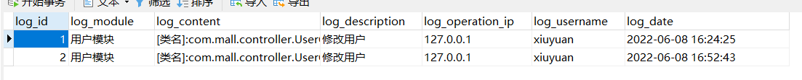

# 操作日志工具

项目内部集成了SpringScurity、Mybatis-plus、mybatis-enhance-actable，其中SpringBoot版本为2.6.8。

引入mybatis-enhance-actable1.5.0.RELEASE 主要是为了自动生成数据库表，没错该项目中集成了一个名叫SysLog的实体类。当项目启动时，会在数据库中生成对应的数据库表。

<hr>

## 使用

在pom.xml中引入，即可使用

```xml
<repositories>
		<repository>
		    <id>jitpack.io</id>
		    <url>https://jitpack.io</url>
		</repository>
</repositories>

<dependency>
	    <groupId>com.github.xiuyuandashen</groupId>
	    <artifactId>log-spring-boot-starter</artifactId>
	    <version>v1.0.1</version>
</dependency>
```

在需要进行操作日志控制的接口上添加`@Log`注解即可

```java
/**
     * 修改用户
     *
     * @param sysUser
     * @return
     */
@PreAuthorize("hasAnyAuthority('system','system:user:edit')")
@PutMapping
@Log(module = "用户模块",description = "修改用户")
public ResultVo edit(@RequestBody User sysUser, Principal principal) {
    userService.checkUserAllowed(sysUser); 
    if (sysUser.getPhonenumber() != null && sysUser.getPhonenumber().trim().length() > 0
        && !userService.checkPhoneUnique(sysUser)) {
        return ResultVo.error().message("用户电话号码不唯一");
    }
    if (sysUser.getEmail() != null && sysUser.getEmail().trim().length() > 0
        && !userService.checkEmailUnique(sysUser)) {
        return ResultVo.error().message("用户邮箱不唯一");
    }
    sysUser.setUpdateBy(principal.getName());
    userService.updateUser(sysUser);
    return ResultVo.ok();
}
```



## 配置

由于项目的架构原因，使用该工具的项目需要使用mybatis&mybatis-plus作为持久层支撑。所以需要在配置文件中加入以下配置 

```yml
# mybatis自行修改
mybatis-plus:
 mapperLocations: 你自己的mapper位置,classpath*:com/gitee/sunchenbin/mybatis/actable/mapping/*/*.xml
```


##  相关文档

[mybatis-enhance-actable](https://www.yuque.com/sunchenbin/actable/nfz097)